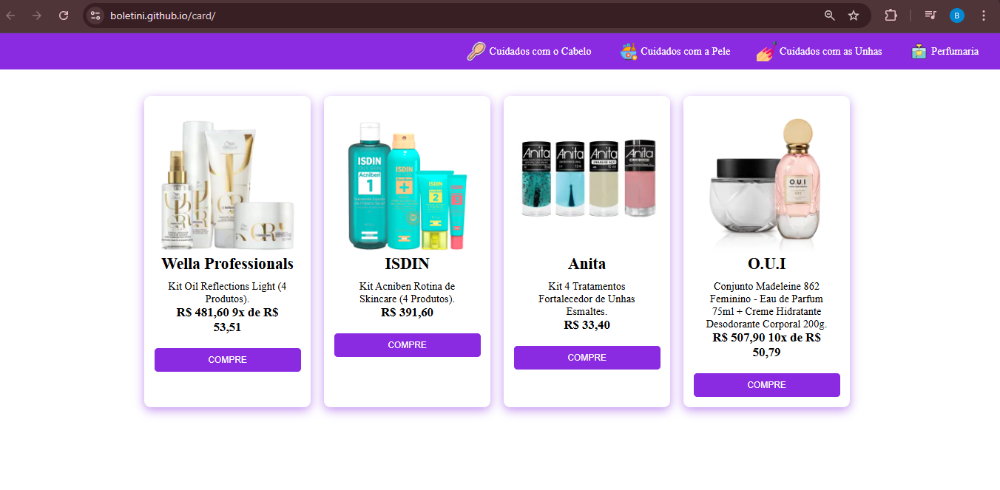

### ATIVIDADE: CRIANDO CARDS - FRONT-END

---

## Sobre 
Atividade da disciplina de Front-End, elaborada com o objetivo de criar cards em uma página utilizado o javasprint, uma atividade visa aplicar, de forma prática os conhecimentos adquiridos ao longo do curso Técnico em Desenvolvimento de Sistemas do [SENAI Jandira](https://sp.senai.br/unidade/jandira/).

---
## Tecnologias utilizadas
- JS
- HTML
- CSS
- MarkDown
- Git

---
## Autor
- [Beatriz Boletini](https://github.com/boletini)
